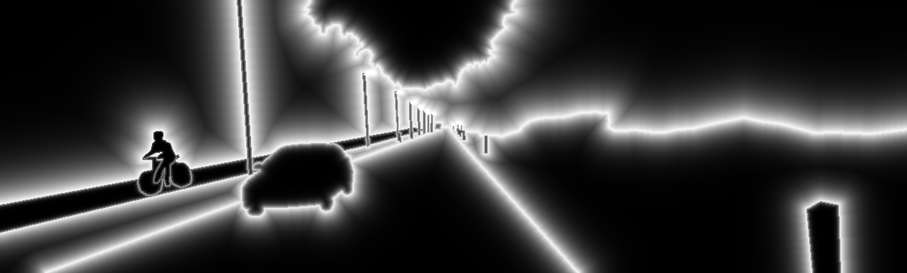
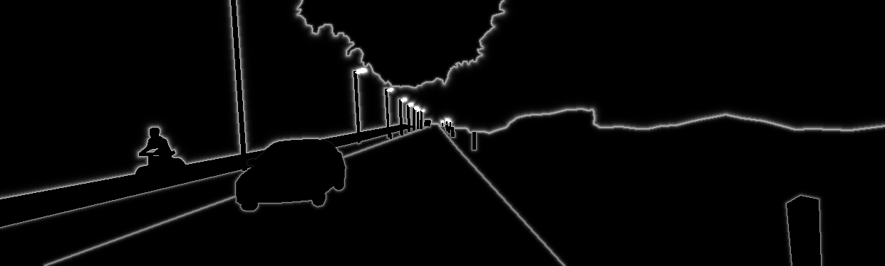

## wIoU (Weighted Intersection over Union)

Weighted Intersection over Union (wIoU) for Evaluating Image Segmentation [[Paper]](https://arxiv.org/abs/2107.09858)

abstract: 
In recent years, many semantic segmentation methods have been proposed to predict label of pixels in the scene.
		In general, we measure area prediction errors or boundary prediction errors for comparing methods. 
		However, there is no intuitive evaluation metric that evaluates both aspects.
		In this work, we propose a new evaluation measure called weighted Intersection over Union (wIoU) for semantic segmentation. First, it builds a weight map generated from a boundary distance map, allowing weighted evaluation for each pixel based on a boundary importance factor. 
		The proposed wIoU can evaluate both contour and region by setting a boundary importance factor. 
		We validated the effectiveness of wIoU on a dataset of 33 scenes and demonstrated its flexibility.
		Using the proposed metric, we expect more flexible and intuitive evaluation in semantic segmentation field are possible.

## Usage

Run below jupyter notebook (.ipynb) files
```
wIoU/demo_wiou.ipynb
wIoU/evaluation_wiou.ipynb
```




